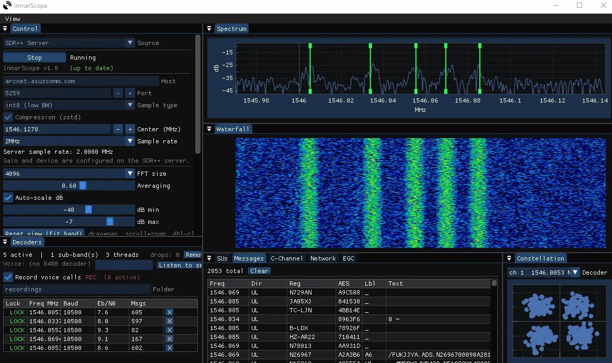

# InmarScope

Multi-protocol L-band satellite communications decoder for Windows (and Linux if you compile it).

Decodes Inmarsat Aero (Classic Aero, Aero-H/H+) and Inmarsat-C/EGC signals in real time using RTL-SDR, HackRF, SDRplay, or SDR++ server sources. Voice call recording, aircraft tracking, and message output in one application.

## Download

This fork's testing builds: **[GitHub Releases](https://github.com/blkph0x/InmarScope/releases)**.

Windows builds can be found on official project page: **https://sarahsforge.dev/products/inmarscope**

## Features

- **Copyable tables** — Copy button, right-click, or Ctrl+C copies decoded text from any pane
- **Reset pane layout** — visible button, View menu, or Ctrl+Shift+R restores default docking without changing radio settings
- **Regional band plans** — 27 bundled plans with 1,739 validated entries, searchable country/region names and independent A/B selection. [Inmarsat plans](bandplans/SATELLITES.md) cover I4A, 4F2, 3F5, 4F3 and 6F1, plus historical 4F1; 4F2 is a receive-band reference only. See [the catalogue](bandplans/CATALOGUE.md) for actual coverage and source limitations; this is not every country worldwide.
- **Pop-out panes** — drag a tab out of the dock to float it anywhere on the desktop
- **PPM adjustment** — crystal offset control for RTL-SDR, RTL-TCP, dual RTL, HackRF, and Airspy
- **Inmarsat Aero** — 600/1200/8400 bps OQPSK signal decoding, voice AMBE decoding, ACARS/ADS-C/CPDLC message parsing
- **Inmarsat-C / EGC** — 1200 bps BPSK decoding with EGC SafetyNet/FleetNet message output
- **SDRplay** — model-discovered antenna selection, sample rates, bandwidth, gains, AGC, PPM, DC/IQ correction and driver-exposed settings (bias tee, notch filters, external reference and HDR where supported). Requires SoapySDRPlay3 and the SDRplay API service; see [SDRPLAY.md](SDRPLAY.md).
- **Dual-SDR voice follow** — use two RTL-SDRs, two SDRplay devices, or the two RSPduo tuners for separate spectra and voice following
- **Voice call recording** — WAV and OGG Vorbis output, tagged with aircraft ICAO
- **Live spectrum & waterfall** — real-time FFT with drag-to-place decoder placement
- **Embedded flight map (Windows)** — plots locally decoded aircraft positions from receivers A/B, with no external aircraft traffic feed. Identity-only records are listed without a marker. OpenStreetMap provides background tiles; incoming aircraft never change your pan/zoom.
- **SBS/BaseStation output** — TCP server on port 30003 for virtual radar clients
- **JAERO-compatible output** — JSON dump, text log, and UDP forwarding
- **Country blacklist** — mute and skip recording for selected countries using ICAO address lookup

## Building

InmarScope supports building for Windows (MSYS2 MINGW64) and Linux (Debian/Ubuntu, Arch, Fedora).

View build instructions at **[COMPILE.md](COMPILE.md)**.

This fork's GitHub Actions builds Windows, Linux and macOS release assets.
See [CI setup and release guide](CI-SETUP.md) and [hardware testing](TESTING.md).

## License

This software is licensed under the **GNU General Public License v3.0**, available to view at **[LICENSE](LICENSE)**.
